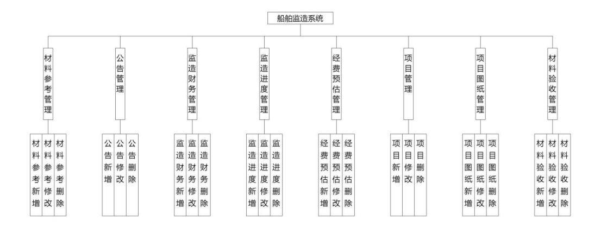
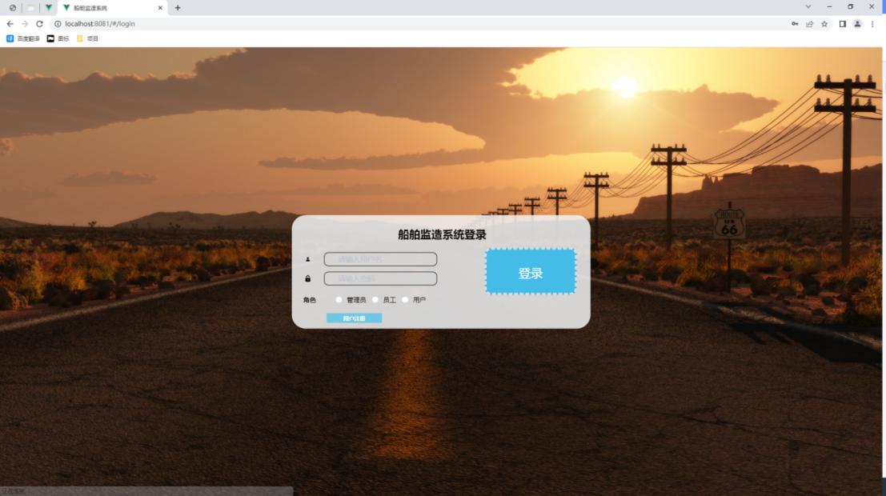
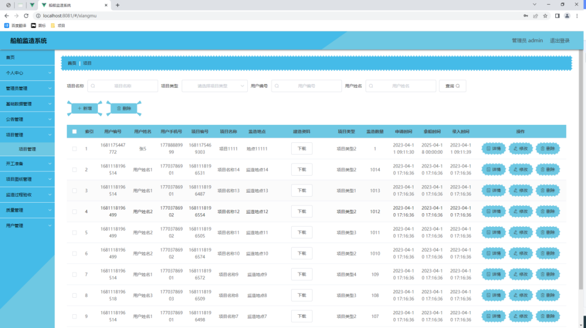
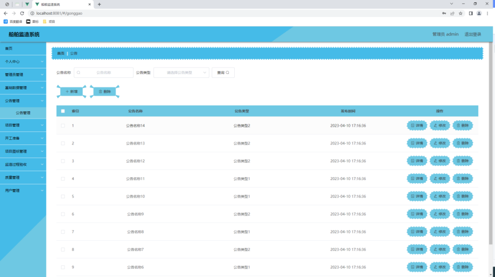
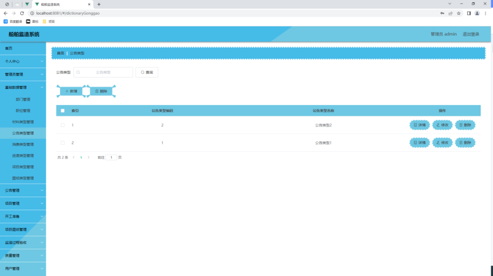
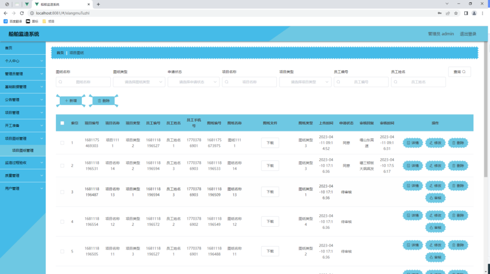
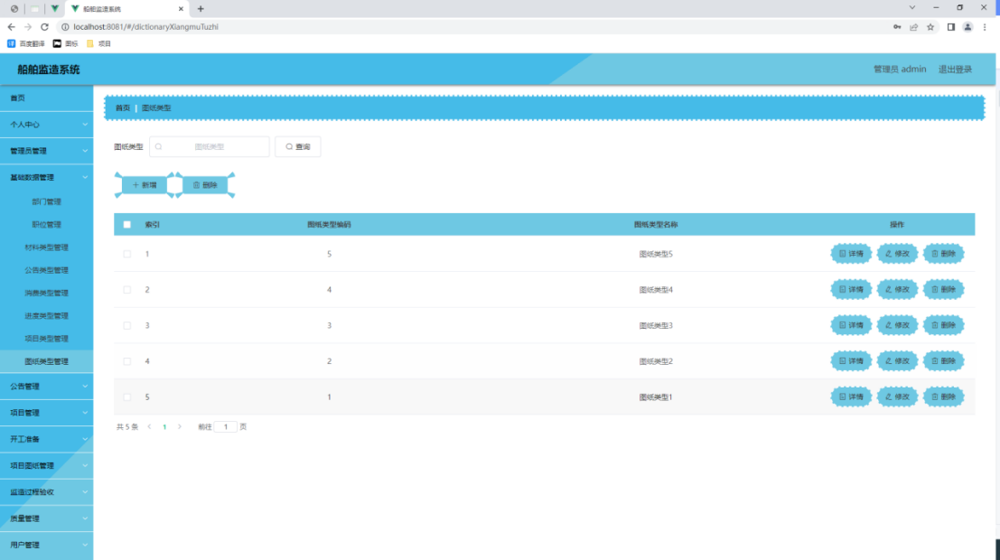
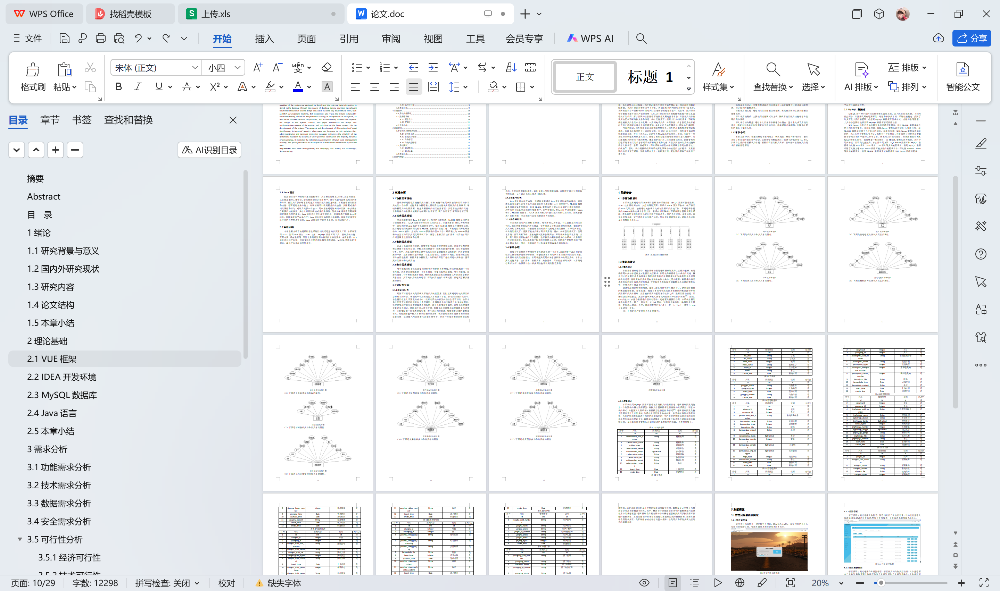

# springboot249-基于SpringBoot的船舶监造系统

>  博主介绍：
>  Hey，我是程序员Chaers，一个专注于计算机领域的程序员
>  十年大厂程序员全栈开发‍ 日常分享项目经验 解决技术难题与技术推荐 承接各类网站设计，小程序开发，毕设等。
>  【计算机专业课程设计，毕业设计项目，Java，微信小程序，安卓APP都可以做，不仅仅是计算机专业，其它专业都可以】

## 3000套系统可挑选，获取链接：https://chaerspol.github.io/

<b>QQ【获取完整源码】：674456564</b>

<b>QQ群【获取完整源码】：1058861570</b>

### 系统架构

> 前端：html | js | css | jquery | vue
>
> 后端：springboot | mybatis
> 
> 环境：jdk1.8+ | mysql | maven

# 一、内容包括
包括有  项目源码+项目论文+数据库源码+答辩ppt+远程调试成功

# 二、运行环境

> jdk版本：1.8 及以上； ide工具：IDEA； 数据库: mysql5.7及以上；编程语言: Java

# 三、需求分析

**3.1功能需求分析**

需求分析过程是系统能否成功投入市场，也能否被用户所接受和使用的非常关键的一个步骤。功能需求分析是通过设计系统功能来实现相关的业务事项，详细分析用户的实际需要，确定需要设计的相关业务事项，其是系统实现的关键，本系统存在的主要功能需求包括用户注册管理、用户信息管理、密码信息管理等。

**3.2技术需求分析**

本系统需要使用Java语言编码设计相关的功能模块，MySQL数据库创建和存储数据表格，AJAX实现前台和后台之间的交互，并且需要在IDEA开发环境中，编写相关的Java代码等系统程序文件，使用MySQL数据库存储数据信息，然后通过使用连接代码完成与MySQL数据库的搭建工作，再通过使用开发环境中的Tomcat插件，完成与Tomcat服务器的发布工作，最后通过与Tomcat服务器的交互行为可以实现代码调试工作。满足以上相关的技术需求，本系统才可以在浏览器上进行访问和使用。

**3.3数据需求分析**

在设计系统功能模块时，需要收集与系统有关的数据信息，并且对采集的数据信息进行组织和存储，分析系统功能设计，筛选有价值的数据，而后形成数据字典。其中，从庞大的数据信息中筛选出有价值的数据是比较耗时，也是非常重要的一步，主要依据信息的来源、信息的有效性、信息的扩充性、信息的真实性等内容筛选数据。数据需求分析阶段，为系统的开发工作做好进一步准备，便于更好的设计和完成系统。

**3.4安全需求分析**

安全需求分析是在系统使用过程中对性能的具体要求，对功能需求的一个补充内容，也是对功能需求的一个补充内容，主要包括响应需求、安全性需求、稳定性需求、可扩展性需求等内容。安全需求是在系统功能需求以外的其他必要的需求内容，其不论在系统设计过程，还是在系统投入市场过程，都起到了极其重要的作用。

**3.5可行性分析**

**3.5.1经济可行性**

经济可行性是决定是否研发系统的关键性因素。我们主要通过比较实际的收益和成本的方法，来确定一个系统是否具有经济可行性。在使用系统的过程中，当获得的收益大于开发的成本时，说明此系统的研发在经济上是可行的。由于本系统的开发使用的技术基本上是开源的，获得技术上的支持是没有多少问题的，在软件实现方面所花费的成本是很低的，甚至不需要花费成本。研发系统的成本主要是来自调研、硬件和技术人员等方面。如果系统中需要存储的数据量不是很大，仅需要配置一台普通的服务器，即可满足相关需求。如果需要存储的数据量很大，则需要配置一台具有独立功能的服务器，比如管理数据库需要单独的数据库服务器，负责接入网站需要web服务器等等，但是一台服务器的价格是比较贵的。考虑到数据量和成本，我们使用小型集群服务器，这样既可以充分利用相关的资源，又可以让系统正常访问服务器。

**3.5.2技术可行性**

Java语言具有跨平台性，本系统主要通过Java语言进行编码实现的，所以本系统可以支持在多个操作系统或者多个浏览器上运行和使用[14]。MySQL数据库是可以被免费使用的，并且MySQL数据库的日常运行和维护工作比较简单，这样有利于降低本系统的开发成本[15]。在学校期间，本人已经学习和掌握了Java语言、MySQL数据库、AJAX技术等相关的技术相关知识以及用法，因此在技术可行性方面，本系统是可以实现被设计与实现的。

**3.5.3操作可行性**

本系统所采用网络结构是VUE，对于开发人员来说，可以直接复用相关的代码，或者稍微对原代码进行修改，使得其满足于本系统的相关需求，如此便可大大节约了开发时间，在最优最短的时间内完成对系统的设计。对于用户来说，在传统的模式下，需要下载客户端才可使用系统。现在，在新型的模式下，使用本系统，就不需要下载，直接选择浏览器打开网址，即可访问和使用本系统。并且，用户可以根据自身的工作需要，选择相关的菜单按钮操作本系统。在系统的一些功能模块中，本人还添加了相关的使用提示信息，方便用户更好更快的了解和使用本系统。因此，本系统的设计和实现是具备操作可行性的。

# 四、功能模块

本系统主要通过使用Java语言编码设计系统功能，MySQL数据库管理数据，AJAX技术设计简洁的、友好的网址页面，然后在IDEA开发平台中，编写相关的Java代码文件，接着通过连接语言完成与数据库的搭建工作，再通过平台提供的Tomcat插件完成信息的交互，最后在浏览器中打开系统网址便可使用本系统。本系统的使用角色可以被分为用户和管理员，用户具有注册、查看信息、留言信息等功能，管理员具有修改用户信息，发布项目图纸等功能，系统总体功能设计图如图。

# 五、效果图展示【部分效果图】

图5-1管理员登录界面【管理员可以选择任一浏览器打开网址，输入信息无误后，以管理员的身份行使相关的管理权限，管理员登录界面设计如图5-1所示。】

图5-2监造项目管理界面【管理员可以通过选择监造项目管理，管理相关的监造项目信息记录，比如进行查看监造项目信息标题，修改监造项目信息来源等操作，监造项目管理界面设计如图5-2所示。】

图5-3 公告管理界面【管理员可以通过选择公告管理，管理相关的公告信息记录，比如进行查看公告详情,删除错误的公告信息,发布公告等操作，公告管理界面如图5-3所示。】

图5-4公告类型管理界面【管理员可以通过选择公告类型管理，管理相关的公告类型信息，比如查看所有公告类型,删除无用公告类型,修改公告类型,添加公告类型等操作，公告类型管理界面设计如图5-4所示。】

图5.5项目图纸管理页面【如图5.5显示的就是项目图纸管理页面，此页面提供给管理员的功能有：新增项目图纸,修改项目图纸,删除项目图纸。】

图5.6 项目图纸类型管理页面【如图5.5显示的就是项目图纸类型管理页面，此页面提供给管理员的功能有：新增项目图纸类型,修改项目图纸类型,删除项目图纸类型。】

 <b>完整文章</b>
 
 
 

## 3000套系统可挑选，获取链接：https://chaerspol.github.io/

<b>QQ【获取完整源码】：674456564</b>

<b>QQ群【获取完整源码】：1058861570</b>

